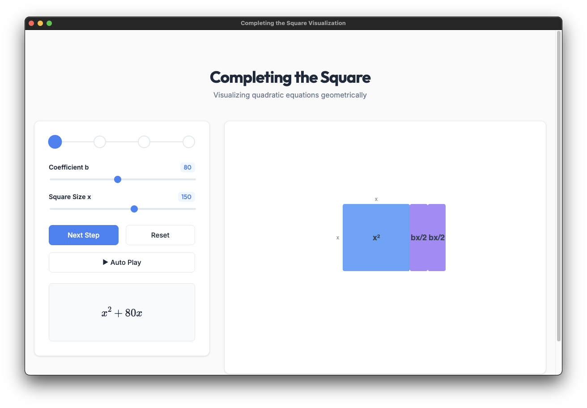

<!DOCTYPE html>
<html lang="en">
<head>
<meta charset="UTF-8">
<meta name="viewport" content="width=device-width, initial-scale=1.0">
</head>
<body>
<h1>Completing the Square</h1>

<a href="https://github.com/Sudo-Aju/CTS_prog/blob/main/dist/completing-the-square-1.0.0-arm64.dmg"><strong>Download CompletingTheSquare.dmg</strong></a>

A simple project designed to help you visualize and solve algebraic equations by completing the square.

<h2>System Requirements</h2>
<ul>
<li>OS: macOS 10.13 or later</li>
<li>Processor: Intel or Apple Silicon</li>
</ul>

<h2>Installation Instructions</h2>

Follow these steps to install the application:

<ol>
<li>
<strong>Open the Disk Image</strong> 
Download and double-click the <code>CompletingTheSquare.dmg</code> file.
</li>
<li>
<strong>Drag to Applications</strong> 
Drag the app icon into the Applications folder shortcut.
</li>
<li>
<strong>Eject</strong> 
Eject the installer drive from your desktop.
</li>
</ol>
<h3>If the App Won't Open</h3>

If you see a warning that the app cannot be opened because the developer cannot be verified:

<ol>
<li>Go to your <strong>Applications</strong> folder.</li>
<li><strong>Right-click</strong> (or Control-click) the app.</li>
<li>Select <strong>Open</strong>.</li>
<li>Click <strong>Open</strong> in the dialog box.</li>
</ol>
<h2>Support</h2>

For questions or bugs, please contact the developer.

</body>
</html>
